<p align="center">
  
</p>

<p align="center">
  <b>A modern take on ProM and CPN IDE, in one app: process mining, Petri nets and coloured Petri nets.</b><br>
  Pure Python + Qt. No Java, no Wine, no separate simulator to install.
</p>

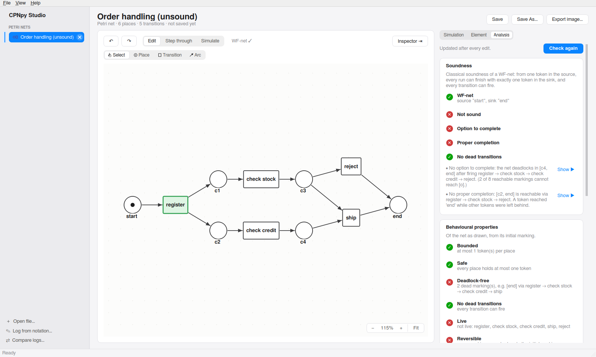

**CPNpy Studio** brings together what usually takes several tools:

| | What you can do | Instead of |
|---|---|---|
| **Petri nets & WF-nets** | Draw nets the way the lectures do. Get a soundness verdict with a counterexample for every violation, and replay it in the token game. Also: behavioural properties, P- and T-invariants, the footprint matrix, the reachability graph, PNML import and export. | WoPeD, ProM, pen and paper |
| **Process mining** | Import XES or CSV logs, or type textbook logs like `[<a,b,c>^3, <a,c>^2]`. Filter them, explore variants, the dotted chart and the process map. Discover models (α-algorithm, Inductive Miner, Heuristics Miner). Check conformance (token replay, alignments, precision…) and compare logs. | ProM, Disco |
| **Coloured Petri nets** | Open, edit and save CPN Tools models (`.cpn`), hierarchical ones included. Step through or simulate them, compute the state space, and export a simulation as an event log to mine. | CPN Tools / CPN IDE |

---

## Contents

- [Install](#install)
- [Quick start](#quick-start)
- [Petri nets and WF-nets](#petri-nets-and-wf-nets)
- [Process mining](#process-mining)
- [Coloured Petri nets](#coloured-petri-nets)
- [Working on the canvas](#working-on-the-canvas)
- [Keyboard shortcuts](#keyboard-shortcuts)
- [Files](#files)
- [For developers](#for-developers)
- [Limitations and roadmap](#limitations-and-roadmap)

---

## Install

CPNpy runs on **macOS, Windows and Linux** (Python 3.10 or newer, with Qt
through PySide6). The easiest way to set it up is a **conda** environment
called `cpnpy`, defined in `environment.yml`.

### 1. Get conda (once)

Install [Miniforge](https://github.com/conda-forge/miniforge), a small conda
that uses the conda-forge packages.

| System | How |
|---|---|
| macOS | `brew install miniforge`, then `conda init zsh` and open a new terminal. (Or the installer from the Miniforge page.) |
| Windows | Download and run **Miniforge3-Windows-x86_64.exe** from the Miniforge page. Then use the **Miniforge Prompt** from the Start menu (or run `conda init powershell` once in it to use conda in PowerShell). |
| Linux | `curl -LO https://github.com/conda-forge/miniforge/releases/latest/download/Miniforge3-Linux-x86_64.sh`, then `bash Miniforge3-Linux-x86_64.sh` and open a new terminal. |

### 2. Get the code and create the environment

The same commands on every system (Terminal on macOS and Linux, Miniforge
Prompt or PowerShell on Windows):

```bash
git clone <the URL of this repository>    # the green "Code" button on GitHub
cd CPNpy
conda env create -f environment.yml       # Python 3.12, PySide6, pytest, CPNpy itself
conda activate cpnpy
```

No git? Use **Code ▸ Download ZIP** on GitHub, unzip it and `cd` into the
folder.

### 3. Start the app

```bash
cpnpy-studio
```

`python -m cpnpy.gui.studio` does the same. After pulling changes that touch
`environment.yml` or `pyproject.toml`, run
`conda env update -f environment.yml --prune`.

<details>
<summary><b>Without conda</b> (plain Python and pip)</summary>

With Python 3.10 or newer from python.org or your package manager, make a
virtual environment in the project folder:

| System | Commands |
|---|---|
| macOS / Linux | `python3 -m venv .venv`<br>`source .venv/bin/activate` |
| Windows (PowerShell) | `py -m venv .venv`<br>`.venv\Scripts\Activate.ps1` |
| Windows (cmd) | `py -m venv .venv`<br>`.venv\Scripts\activate.bat` |

Then, on every system:

```bash
pip install -e ".[gui,dev]"
cpnpy-studio
```

If PowerShell refuses to run `Activate.ps1`, allow local scripts once with
`Set-ExecutionPolicy -Scope CurrentUser RemoteSigned`.
</details>

**Linux:** Qt needs a few system libraries that desktop installs usually
have. If the app does not start and the error mentions the "xcb" platform
plugin or `libEGL.so.1`, install them, e.g. on Ubuntu/Debian:
`sudo apt install libxcb-cursor0 libxkbcommon-x11-0 libegl1`.

Keyboard shortcuts follow the system: **⌘** on a Mac, **Ctrl** on Windows
and Linux (see [Keyboard shortcuts](#keyboard-shortcuts)).

---

## Quick start

**Check whether a WF-net is sound**

1. **File ▸ New Petri Net** (⌘N / Ctrl+N).
2. Pick **Place** and click on the canvas. Type a name and press Return (or
   click elsewhere to keep the suggested name), and the tool switches back to
   Select on its own. Do the same with **Transition**.
3. Pick **Arc** and drag from a place to a transition, or the other way
   round. Drag again from the same node to add more arcs.
4. Open the **Analysis** tab on the right. It shows whether the net is a
   WF-net, whether it is sound, its behavioural properties and its
   footprint. Everything updates after each edit.
5. If it isn't sound, press **Show ▶** next to a finding. The net switches to
   *Step through* and fires the counterexample, so you can see the problem
   marking.

To try this without drawing, use **File ▸ Open Example Petri Net ▸ Order
handling (unsound — try Analysis)**.

**Mine a log**

1. **✎ Log from notation…** (⌘L / Ctrl+L) and type `[<a,b,c,d>^3, <a,c,b,d>^2, <a,e,d>]`
   (pasting `[⟨a,b,c,d⟩³, …]` from the book works too), or open a `.xes` /
   `.csv` file.
2. Look through the tabs: *Overview*, *Variants*, *Cases*, *Dotted chart*,
   *Process map*, *Footprint*. **Filter…** keeps part of the log as a new
   log.
3. On the *Discover* tab, pick an algorithm and press **Discover**. **Open as
   model →** adds the result to the sidebar under **MODELS**.
4. On the model's *Conformance* tab, choose a log and press **Check
   conformance**.

**Simulate a coloured net**

**File ▸ Open Coloured Petri Net…** (⇧⌘O / Ctrl+Shift+O), then *Step through* or
*Simulate*.

---

## Petri nets and WF-nets

Nets drawn as in the lectures and the book:

- **Places** are circles with black tokens inside, drawn as dots up to 5 and
  as a number above that.
- **Transitions** are boxes with their name inside. A **silent (τ)**
  transition is a black bar.
- **Arc weights** above 1 are written on the arc.
- **Names** go inside the places and transitions, which grow to fit them.
  Tick **Names outside** in the toolbar to put them underneath instead; you
  can then drag each name where you want it. Both are saved in the PNML file.

Select anything to edit it in the **Element** tab: a place's name and
tokens, whether a transition is silent, an arc's weight and direction.

**Analysis tab**

Every property is defined mathematically in
[**docs/definitions.md**](docs/definitions.md). In the app, **hover over a
property** (the ones marked ⓘ) to see its definition *filled in for your
net* — with your place names, and when it fails, the marking and firing
sequence that break it. **Click** it to keep the definition open and follow
links to the definitions it builds on; **Help ▸ Definitions** lists them all.

<p align="center">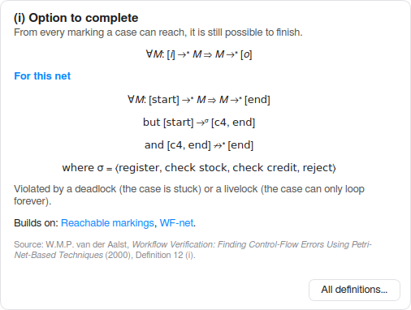</p>

- **WF-net:** exactly one source place *i*, one sink place *o*, and every
  node on a path between them.
- **Soundness:**
  - (i) option to complete;
  - (ii) proper completion;
  - (iii) no dead transitions.

  Every violation comes with a firing sequence as its counterexample, and
  **Show ▶** plays it on the net.
- **Short-circuited net N̄:** the net plus a transition *t\** from *o* back
  to *i*. By the soundness theorem, the net is sound iff (N̄, [i]) is **live
  and bounded**; both are shown, with the transition that can't fire again
  and the marking where that happens. Safe and deadlock-free are shown too.
  **Open the short-circuited net** draws it.
- **Structure:** **free-choice**, **well-structured** (no PT- or TP-handles
  in N̄, with the two paths of a handle spelled out) and **S-coverable**,
  plus the start and end rule: a quick check for transitions that need *i*
  or *o* together with another place.
- **Invariants:** the **P-invariants** (weighted token counts that never
  change, e.g. `start + c1 + c3 + end = 1`) and the **T-invariants** (of N̄
  for a WF-net), and whether they cover the net. Covered by P-invariants
  means bounded from any marking; a transition in no T-invariant of N̄ proves
  the WF-net unsound. **Incidence matrix…** shows the matrix they come from.
- **Behavioural properties** of the net as drawn: bounded, safe,
  deadlock-free, dead transitions, live, reversible. A WF-net always stops
  in [o], so that dead marking is marked as expected.
- **Footprint:** the → ← ‖ # matrix of the net's behaviour, to compare with
  a log's footprint (α-algorithm, footprint conformance).
- **Reachability graph…**, or a coverability graph with ω when the net is
  unbounded.
- **Conformance with a log…** opens the net as a model next to your logs,
  for token replay and alignments.

| The counterexample, replayed | The footprint of the net |
|---|---|
| 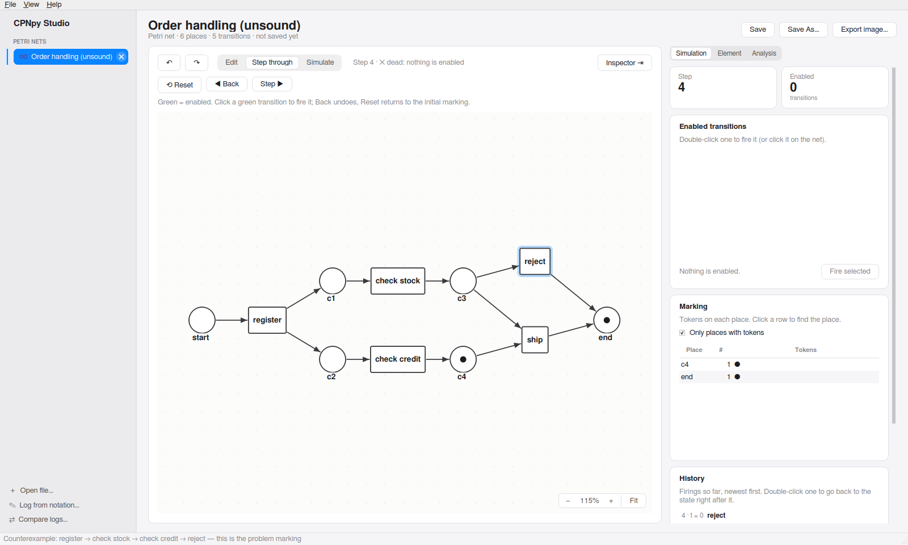 | 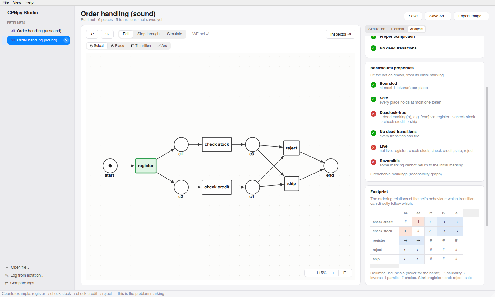 |

**Also on the Petri net page**

- **Step through / Simulate:** the token game, fired by hand or at random.
  With **Trace** ticked, every fired transition shows its step numbers and
  the arcs the tokens used light up, the latest step strongest.
- **Generate event log…:** plays the net out many times and opens the
  traces as a log.
- **Saving:** nets are saved as **PNML** (ProM, WoPeD and PM4Py read it), or
  as `.cpn`.
- **Opening:** a `.pnml` file opens in this editor. A model you discovered
  has **✎ Edit a copy** to bring it here.

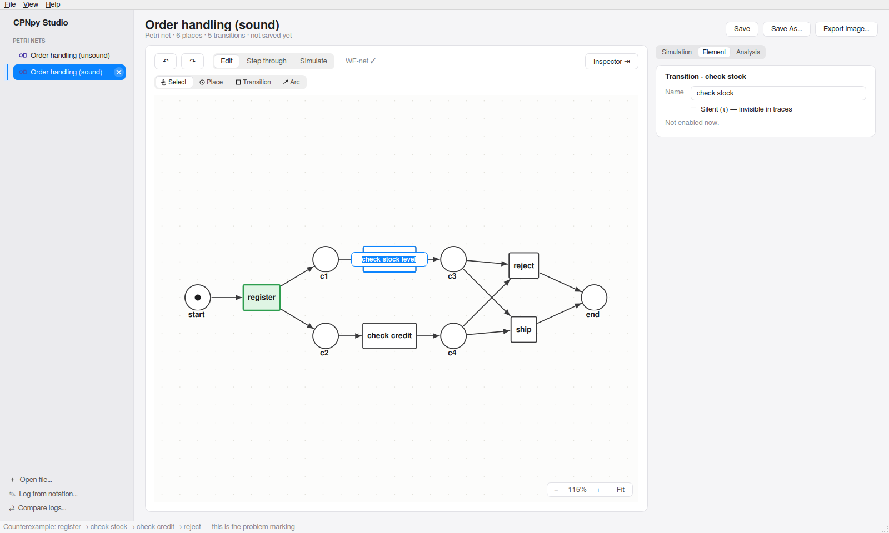

---

## Process mining

| Log overview | Dotted chart |
|---|---|
| 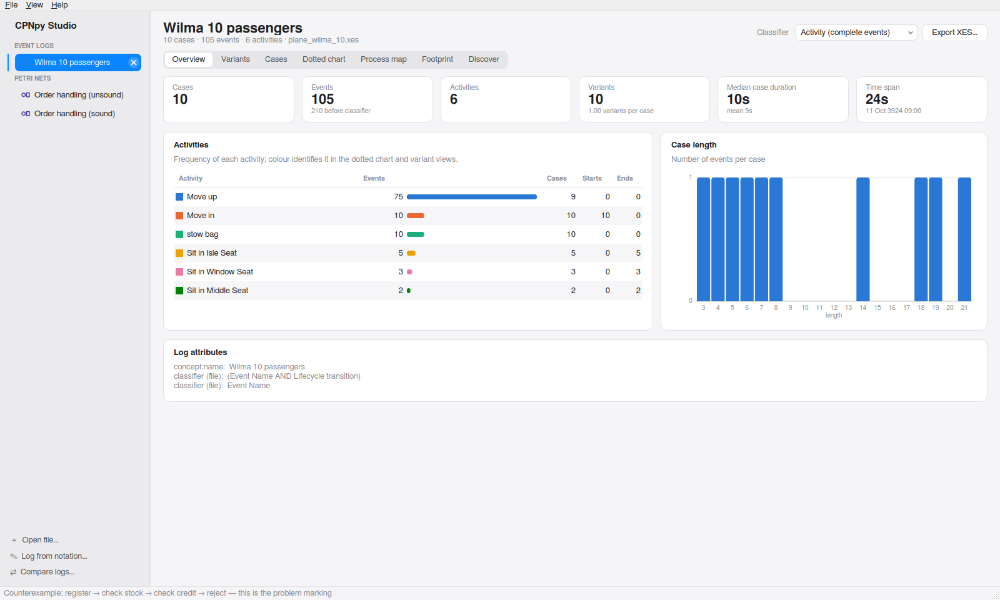 | 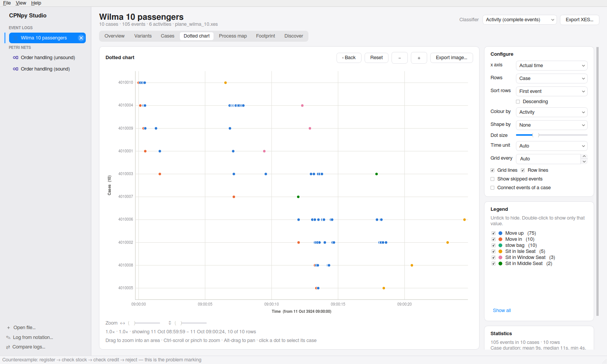 |

- **Logs:**
  - XES, XES.GZ and CSV (you map the columns);
  - the course's notation, e.g. `[<a,b,c,d>^3, <a,e,d>]` (or `⟨a,b⟩³` as
    in the book);
  - XES and CSV export.
- **Filter** (as in ProM and Disco): keep cases in a time frame, cases that
  start or end with chosen activities, only the events of chosen activities
  (or the cases that do or do not contain them), cases of a certain length,
  and the most frequent variants. A preview shows what is left; the result
  opens as a new log.
- **Explore:** overview figures, variants, cases, a ProM-style **dotted
  chart**, a **process map** (directly-follows graph with frequency or
  performance), and the **footprint** matrix.
  - Dotted chart axes: actual time, time since case start, % of case
    duration, or logical order (in the log, or within the case).
  - Time unit (Auto, or seconds up to years) and a grid step you can type in.
  - Colour and shape by any attribute. The default palette can be changed
    per value: right-click a value in the legend and pick its colour.
- **Discover:**
  - α-algorithm, which shows its eight steps;
  - Inductive Miner and IMf;
  - Heuristics Miner, as a dependency graph or as a Petri net: which forks
    are AND and which XOR is learned from the log (a causal net, whose
    bindings are listed). Like in ProM, such a net fits its log but is not
    always sound.
- **Models:**
  - token game;
  - soundness and properties;
  - reachability graph;
  - PNML / PNG / SVG export.
- **Conformance:**
  - token-based replay and optimal alignments, both drawn on the model;
  - fitness, precision, generalisation and simplicity;
  - alignments per variant.
- **Compare logs:** key figures, activity and variant shares, and linked
  dotted charts, side by side.

| Process map | Discovering a model |
|---|---|
| 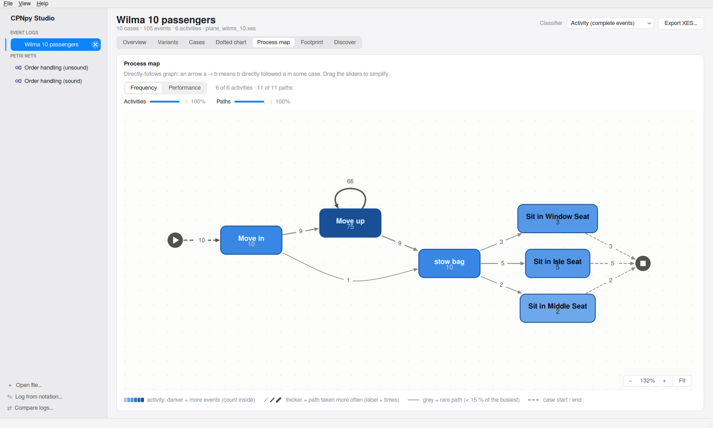 | 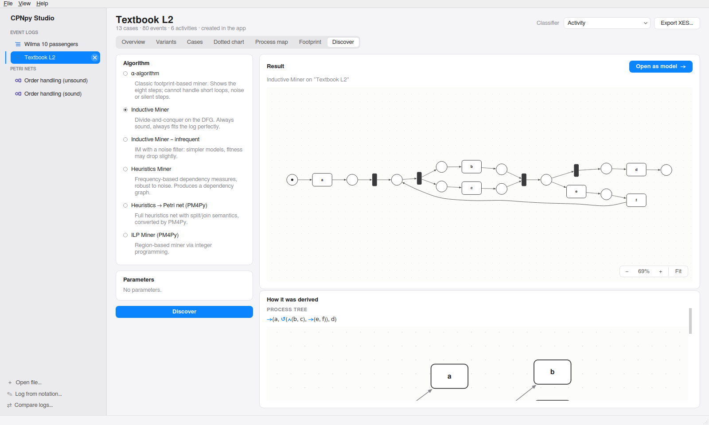 |

| α-algorithm result | Conformance (alignments on the model) |
|---|---|
| 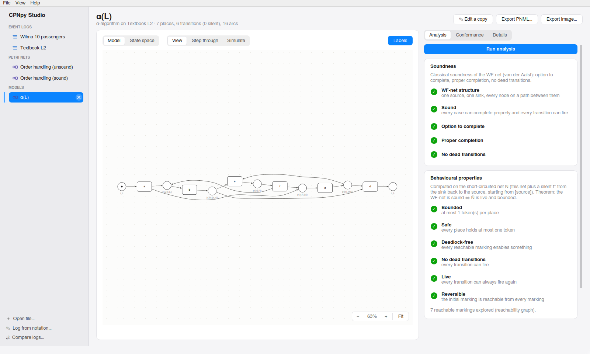 | 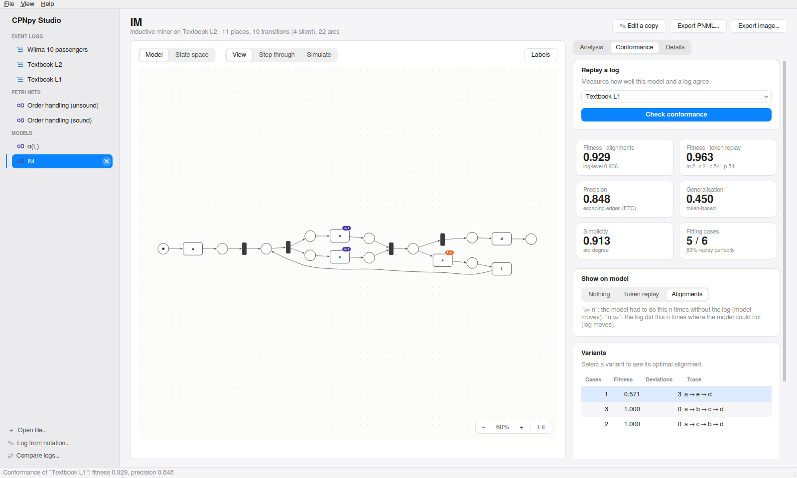 |

| Comparing two logs | Linked dotted charts of three boarding strategies |
|---|---|
| 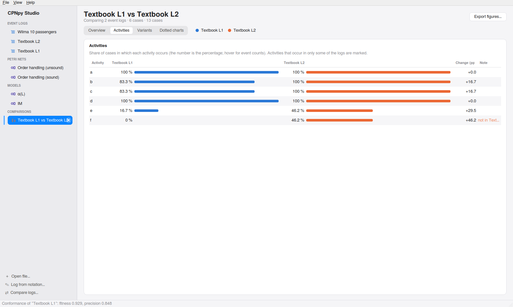 | 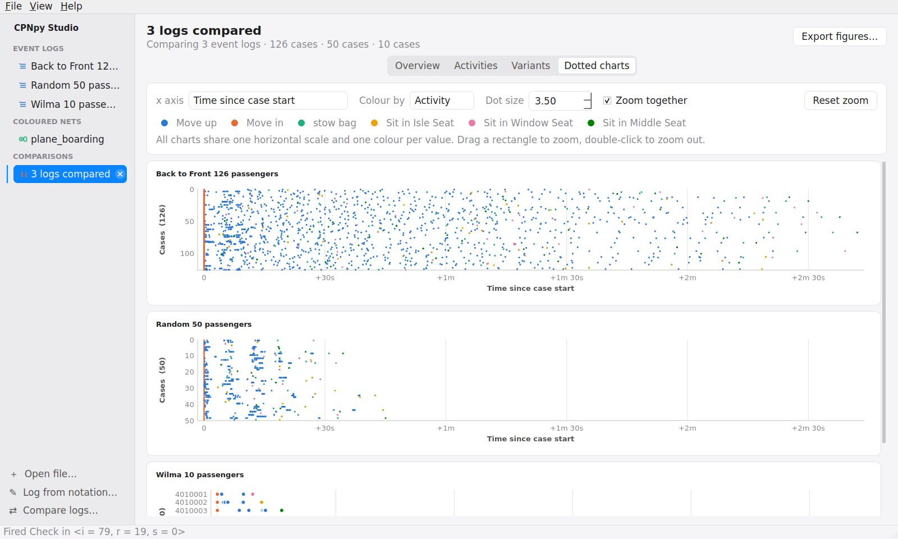 |

The app follows the system's light or dark appearance:

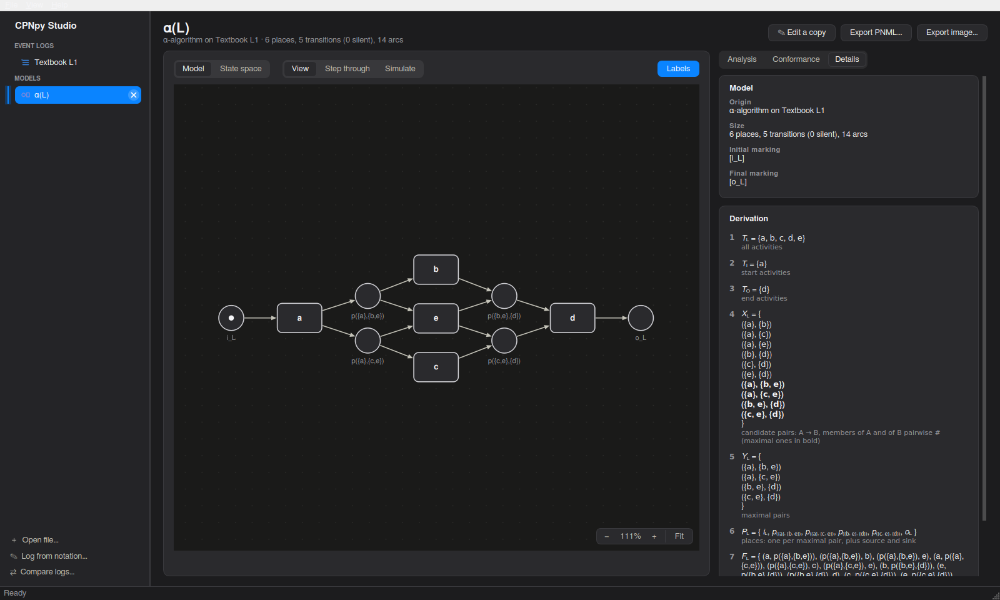

---

## Coloured Petri nets

A reimplementation of the modelling, simulation and analysis parts of CPN
Tools / CPN IDE, including their **CPN ML** inscription language: colour
sets, variables, functions, guards and timed tokens.

- **Edit:** places, transitions and arcs, with their inscriptions, guards,
  time delays and declarations (syntax-highlighted). Undo and redo cover
  everything.
- **Hierarchy:** substitution transitions run their subpages (a port place
  is the socket place it is assigned to), also several levels deep. Select
  a substitution transition and press **Open subpage** to go there.
- **Step through:** green transitions are enabled. Click one to fire it, or
  pick an exact binding in the inspector. **Back** undoes a step, and
  **Trace** highlights the path so far.
- **Simulate:** Play (1–60 firings per second) or Fast-forward. The firing
  history can be exported **as an event log** and mined straight away.
- **State space:** runs in a separate process, so it can be stopped at any
  moment. It reports dead markings, home markings, liveness and bounds.
- **Rendering:** models look the way CPN Tools and CPN IDE draw them
  (bendpoints, label positions, token bubbles), and they save back to
  `.cpn`.

| Stepping through a model | Editing an arc (handles on every bend) |
|---|---|
| 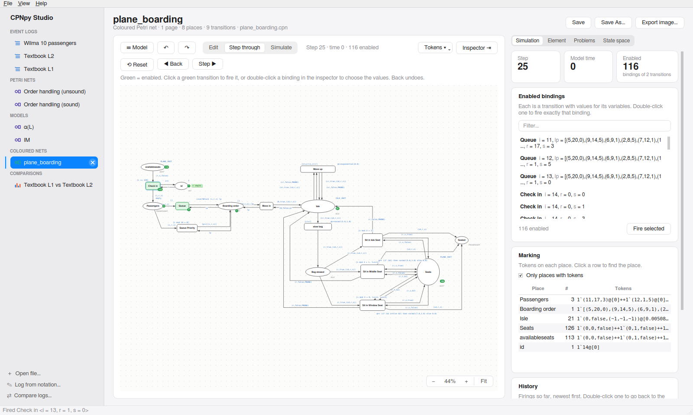 | 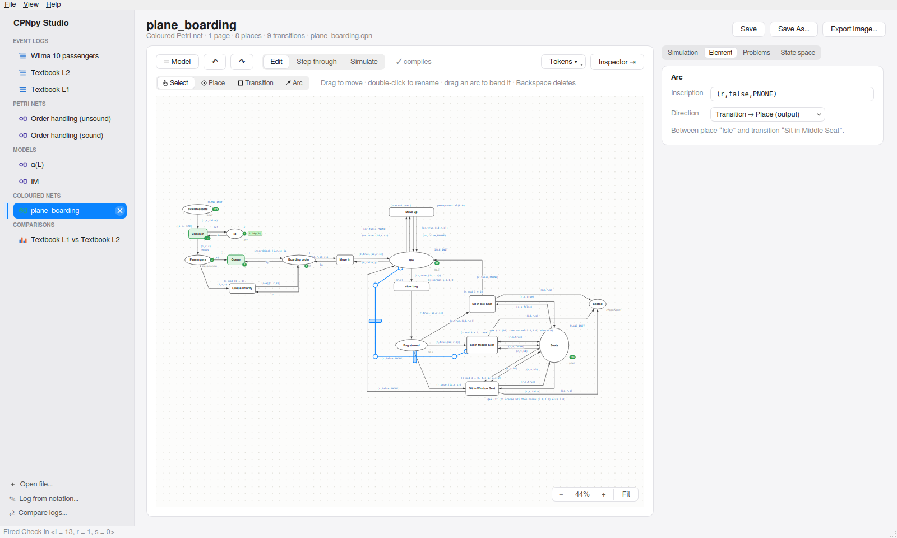 |

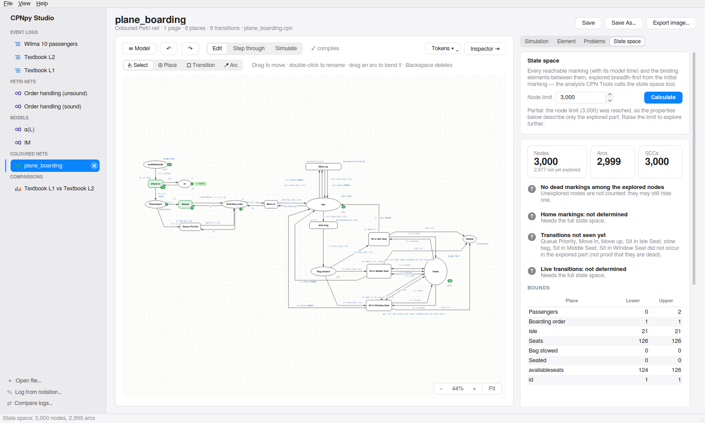

---

## Working on the canvas

Both editors work the same way. Arcs follow the rules of CPN IDE.

| To… | Do this |
|---|---|
| Add a place / transition | Pick **Place** / **Transition**, click the canvas, type the name, press Return (or just click elsewhere: the name box closes and keeps the name) |
| Rename | Double-click the place or transition, or use the Element tab |
| Connect | Hover near a place or transition and drag the translucent arrow that appears onto another node. Or pick **Arc** and drag from one node to another, or click one node, then the other. Joining two places (or two transitions) is refused, with an explanation. Esc cancels. |
| Move things | Drag them. Nodes snap into line with other nodes (dashed guides show it). Drag on empty canvas to select several. |
| Bend an arc | Press anywhere on the arc and drag: that adds a bend. Drag an existing bend (a small circle) to move it. |
| Remove a bend | Drag it back into line with its neighbours |
| Slide a straight segment | Drag the bar in the middle of a horizontal or vertical segment |
| Reconnect an arc | Drag one of its ends onto another node |
| Move a label | Drag it (names can be dragged once **Names outside** is ticked) |
| Delete | Select, then Delete or Backspace (⌫) |
| Undo / redo | ⌘Z / ⇧⌘Z (Ctrl+Z / Ctrl+Shift+Z), or ↶ ↷ |

The tool buttons have icons, and the mouse cursor over the canvas shows the
active tool: a plain pointer for Select, a crosshair with a circle, square
or arrow for the others.

---

## Keyboard shortcuts

The app shows each shortcut the way your system writes it.

| Action | macOS | Windows / Linux |
|---|---|---|
| New Petri net | ⌘N | Ctrl+N |
| New coloured Petri net | ⇧⌘N | Ctrl+Shift+N |
| Open… | ⌘O | Ctrl+O |
| Open coloured Petri net… | ⇧⌘O | Ctrl+Shift+O |
| Log from notation… | ⌘L | Ctrl+L |
| Compare logs… | ⇧⌘C | Ctrl+Shift+C |
| Save / Save As | ⌘S / ⇧⌘S | Ctrl+S / Ctrl+Shift+S |
| Undo / Redo | ⌘Z / ⇧⌘Z | Ctrl+Z / Ctrl+Shift+Z (or Ctrl+Y) |
| Delete selection | ⌫ | Delete or Backspace |
| Step (fire one random enabled transition) | ⌘. | Ctrl+. |
| Zoom in / out / fit / 100 % | ⌘+ / ⌘− / ⌘0 / ⌥⌘0 | Ctrl++ / Ctrl+− / Ctrl+0 / Ctrl+Alt+0 |
| Zoom with the mouse | ⌘-scroll or pinch | Ctrl+scroll or pinch |
| Toggle sidebar | ⌥⌘S | Ctrl+Alt+S |
| Welcome page | ⌘1 | Ctrl+1 |
| Export selected… | ⌘E | Ctrl+E |
| Remove from workspace / remove all | ⌘W / ⇧⌘W | Ctrl+W / Ctrl+Shift+W |
| Cancel drawing an arc | Esc | Esc |

---

## Files

| Format | Read | Write |
|---|---|---|
| Event logs: `.xes`, `.xes.gz`, `.csv` | ✓ | `.xes`, `.xes.gz`, `.csv` |
| Petri nets: `.pnml` (with positions, weights, τ, arc bends) | ✓ | ✓ |
| CPN Tools models: `.cpn` | ✓ | ✓ |
| Pictures of nets and charts | | `.png`, `.svg` |

Example files: `examples/petri/*.pnml` (Petri nets), `examples/*.cpn`
(coloured nets) and `tests/data/` (a plane-boarding model and log from the
course).

---

## For developers

```bash
pytest -q                 # the whole suite, including GUI tests that run offscreen
cpnpy --help              # command line: check, simulate, state space, mining
```

The same commands work on macOS, Windows and Linux. `cpnpy mine` covers the
process mining side: `stats`, `filter`, `discover` (α, IM, IMf, heuristics),
`conform`, `soundness` and `invariants`. `docs/definitions.md` is
generated from `cpnpy/mining/definitions.py`; after editing a definition, run
`python -m cpnpy.mining.definitions > docs/definitions.md` (a test checks it).

The engines (`cpnpy.mining`, `cpnpy.ml`, `cpnpy.sim`, `cpnpy.analysis`)
have **no dependencies**, so they work in a notebook or a script:

```python
from cpnpy.mining import read_xes, inductive_miner
from cpnpy.mining.analysis import check_soundness

net = inductive_miner(read_xes("log.xes").simple_log()).net
report = check_soundness(net)
print(report.sound, report.findings)
```

[**docs/how-it-works.md**](docs/how-it-works.md) covers the architecture, the
CPN ML subset, binding search, timed nets, the state space, the file format
and the project layout.

---

## Limitations and roadmap

Plainly stated:

1. **A subpage used by several substitution transitions** (one module,
   several instances) is reported as a problem rather than simulated: give
   each use its own copy of the page. Subpages used once, at any depth,
   simulate.
2. **No CPN monitors or simulation reports**, and **no fairness
   properties** in the state space report (it says so).
3. **CPN ML is a large subset, not all of Standard ML**: no `exception`
   declarations or `handle`, no `datatype` or `structure` declarations, and
   characters are one-letter strings. See
   [docs/how-it-works.md](docs/how-it-works.md#the-cpn-ml-subset).
4. **Alignments are exact but unoptimised**: they can take seconds on
   heavily concurrent models. They run in the background.
5. **Plain Petri nets live on one page.**

Next up: several instances of a subpage, CPN monitors, and app bundles so
CPNpy starts like any other desktop app.

## Licence

MIT. See [LICENSE](LICENSE).
