<p align="center">
  
</p>

<p align="center">
  <b>Process mining, Petri nets and workflows in one open app.</b><br>
  Every algorithm is there to read, every result can be reproduced, every step can be taught.<br>
  Pure Python and Qt. No Java, no Wine, no separate simulator to install.
</p>

<p align="center">
  <a href="https://github.com/s4mstruthers/openprocess/releases/latest"></a>
  <a href="https://pypi.org/project/openprocess/"></a>
  <a href="https://github.com/s4mstruthers/openprocess/actions/workflows/build-apps.yml"></a>
  <a href="LICENSE"></a>
</p>

<p align="center">
  <a href="https://github.com/s4mstruthers/openprocess/releases/latest"><b>⬇ Download for macOS, Windows or Linux</b></a>
  · no Python needed · or <code>pip install openprocess[app]</code> · <a href="#install">install guide</a>
</p>

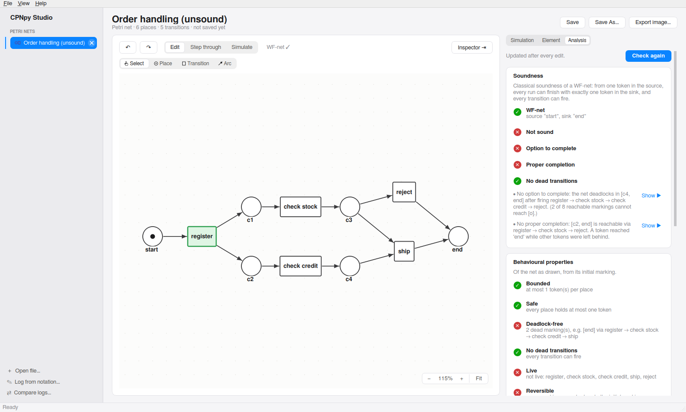

**OpenProcess Studio** is the workbench; **OpenProcess Learn** is the teaching
mode built on it. Together they bring under one roof what usually takes several
tools (and, until version 0.7, went by the name CPNpy):

| | What you can do | Instead of |
|---|---|---|
| **Petri nets & WF-nets** | Draw nets the way the lectures do. Get a soundness verdict with a counterexample for every violation, and replay it in the token game. Also: behavioural properties, P- and T-invariants, the footprint matrix, the reachability graph, PNML import and export. | WoPeD, ProM, pen and paper |
| **Process mining** | Import XES or CSV logs, or type textbook logs like `[<a,b,c>^3, <a,c>^2]`. Filter them, explore variants, the dotted chart and the process map. Discover models (α-algorithm, Inductive Miner, Heuristics Miner, state-based regions). Check conformance (token replay, alignments, precision…) and compare logs. | ProM, Disco |
| **Coloured Petri nets** | Open, edit and save CPN Tools models (`.cpn`), hierarchical ones included. Step through or simulate them, compute the state space, and export a simulation as an event log to mine. | CPN Tools / CPN IDE |
| **Workflows** | Boxes on a canvas: a log, a miner, a fitness check, a comparison, a sweep over a setting, a prediction pipeline. Click a box to see its result, *how* it got there (the α-algorithm's eight steps, the replay per variant), its code and its settings. Change a setting and only what follows runs again. Saved as a `.cpnflow` file with everything needed to get the same numbers back. Your own algorithm is one Python function in a `boxes/` folder. | RapidProM |
| **Learn** | A mode of its own for worksheets, built on the app: answer in boxes on the sheet (sets, markings, matrices, cuts and trees, alignments, a net in the editor or a workflow on the canvas beside it) and press **Check**. Most answers are checked automatically, often against answers worked out from the given log or net. Packs are plain Markdown, can be exams with a clock and points, and a past exam imports as a skeleton pack. Demo exercises included. | Answer sheets, a notes app and guesswork |
| **Folders** | Open a folder such as *Week 2*: every log and net in it is listed in the sidebar, with its subfolders. The folder and the app stay in step both ways: new nets and edits are saved into it as you go, and changes made in Finder show up by themselves. | Finder windows and *File ▸ Open* every time |

---

## Contents

- [Install](#install)
- [Quick start](#quick-start)
- [Folders: one per week](#folders-one-per-week)
- [Petri nets and WF-nets](#petri-nets-and-wf-nets)
- [Process mining](#process-mining)
- [Learn](#learn)
- [Coloured Petri nets](#coloured-petri-nets)
- [Working on the canvas](#working-on-the-canvas)
- [Keyboard shortcuts](#keyboard-shortcuts)
- [Files](#files)
- [For developers](#for-developers)
- [Workflows](#workflows)
- [Workflows from Python](#workflows-from-python)
- [Limitations and roadmap](#limitations-and-roadmap)

---

## Install

OpenProcess runs on **macOS, Windows and Linux**. Download the app, or run it from
source if you want to change the code.

### Download the app

No Python needed. Take the file for your system from the
[latest release](https://github.com/s4mstruthers/openprocess/releases/latest):

| System | File | Then |
|---|---|---|
| macOS | `OpenProcess-…-macOS-arm64.dmg` (Apple silicon) or `…-macOS-x64.dmg` (Intel) | Open it and drag **OpenProcess** onto **Applications**. |
| Windows | `OpenProcess-…-Windows-x64.zip` | Unzip it anywhere and start `OpenProcess\OpenProcess.exe`. For a desktop shortcut: right-click `OpenProcess.exe` ▸ *Send to* ▸ *Desktop*. |
| Linux | `OpenProcess-…-Linux-x64.tar.gz` | `tar xzf OpenProcess-*.tar.gz`, then `./OpenProcess/install-desktop-entry.sh` to add it to the applications menu and the desktop. |

The apps are not signed with a paid developer certificate, so the system asks
once, the first time you start one:

- **macOS** says Apple could not check it. Click *Done*, then open *System
  Settings ▸ Privacy & Security* and click *Open Anyway* next to OpenProcess. (Or
  in Terminal: `xattr -dr com.apple.quarantine /Applications/OpenProcess.app`.)
- **Windows** shows *Windows protected your PC*. Click *More info*, then
  *Run anyway*.

Later versions install themselves: the app says when one is out, or ask with
**Help ▸ Check for Updates…**.

### With pip

For a script, a notebook, a box of your own, or CI, OpenProcess is a normal
Python package with no required dependencies:

```
pip install openprocess            # the engine: process mining, Petri nets, workflows, Learn
pip install "openprocess[app]"     # also the desktop app: then `openprocess studio`
pip install "openprocess[app,science]"   # and the pandas, SciPy and matplotlib boxes
```

Code written for CPNpy keeps working: `import cpnpy` is `openprocess` under
its old name (with a one-line warning), so existing boxes and exercise packs
run unchanged.

### From source

You need Python 3.10 or newer, with Qt through PySide6. The easiest way to set
it up is a **conda** environment called `openprocess`, defined in `environment.yml`.

#### 1. Get conda (once)

Install [Miniforge](https://github.com/conda-forge/miniforge), a small conda
that uses the conda-forge packages.

| System | How |
|---|---|
| macOS | `brew install miniforge`, then `conda init zsh` and open a new terminal. (Or the installer from the Miniforge page.) |
| Windows | Download and run **Miniforge3-Windows-x86_64.exe** from the Miniforge page. Then use the **Miniforge Prompt** from the Start menu (or run `conda init powershell` once in it to use conda in PowerShell). |
| Linux | `curl -LO https://github.com/conda-forge/miniforge/releases/latest/download/Miniforge3-Linux-x86_64.sh`, then `bash Miniforge3-Linux-x86_64.sh` and open a new terminal. |

#### 2. Get the code and create the environment

The same commands on every system (Terminal on macOS and Linux, Miniforge
Prompt or PowerShell on Windows):

```bash
git clone https://github.com/s4mstruthers/openprocess.git
cd OpenProcess
conda env create -f environment.yml       # Python 3.12, PySide6, pytest, OpenProcess itself
conda activate openprocess
```

No git? Use **Code ▸ Download ZIP** on GitHub, unzip it and `cd` into the
folder.

#### 3. Start the app

```bash
openprocess-studio
```

`python -m openprocess.gui.studio` does the same. After pulling changes that touch
`environment.yml` or `pyproject.toml`, run
`conda env update -f environment.yml --prune`.

<details>
<summary><b>Without conda</b> (plain Python and pip)</summary>

With Python 3.10 or newer from python.org or your package manager, make a
virtual environment in the project folder:

| System | Commands |
|---|---|
| macOS / Linux | `python3 -m venv .venv`<br>`source .venv/bin/activate` |
| Windows (PowerShell) | `py -m venv .venv`<br>`.venv\Scripts\Activate.ps1` |
| Windows (cmd) | `py -m venv .venv`<br>`.venv\Scripts\activate.bat` |

Then, on every system:

```bash
pip install -e ".[app,dev]"
openprocess-studio
```

If PowerShell refuses to run `Activate.ps1`, allow local scripts once with
`Set-ExecutionPolicy -Scope CurrentUser RemoteSigned`.
</details>

**Linux:** Qt needs a few system libraries that desktop installs usually
have. If the app does not start and the error mentions the "xcb" platform
plugin or `libEGL.so.1`, install them, e.g. on Ubuntu/Debian:
`sudo apt install libxcb-cursor0 libxkbcommon-x11-0 libegl1`.

Keyboard shortcuts follow the system: **⌘** on a Mac, **Ctrl** on Windows
and Linux (see [Keyboard shortcuts](#keyboard-shortcuts)).

---

## Quick start

**Work in a folder** (recommended): **File ▸ Open Folder…**
(⌥⌘O / Ctrl+Alt+O) and pick a folder such as *Week 2*, or drop the folder
onto the window. See [Folders](#folders-one-per-week).

**Check whether a WF-net is sound**

1. **File ▸ New Petri Net** (⌘N / Ctrl+N).
2. Pick **Place** and click on the canvas. Type a name and press Return (or
   click elsewhere to keep the suggested name), and the tool switches back to
   Select on its own. Do the same with **Transition**.
3. Pick **Arc** and drag from a place to a transition, or the other way
   round. Drag again from the same node to add more arcs.
4. Open the **Analysis** tab on the right. It shows whether the net is a
   WF-net, whether it is sound, its behavioural properties and its
   footprint. Everything updates after each edit.
5. If it isn't sound, press **Show ▶** next to a finding. The net switches to
   *Step through* and fires the counterexample, so you can see the problem
   marking.

To try this without drawing, use **File ▸ Open Example Petri Net ▸ Order
handling (unsound — try Analysis)**.

**Mine a log**

1. **✎ Log from notation…** (⌘L / Ctrl+L) and type `[<a,b,c,d>^3, <a,c,b,d>^2, <a,e,d>]`
   (pasting `[⟨a,b,c,d⟩³, …]` from the book works too), or open a `.xes` /
   `.csv` file.
2. Look through the tabs: *Overview*, *Variants*, *Cases*, *Dotted chart*,
   *Process map*, *Footprint*. **Filter…** keeps part of the log as a new
   log.
3. On the *Discover* tab, pick an algorithm: the model and how it was
   derived update straight away. **Open as model →** adds the result to the sidebar (under **MODELS**, or
   **UNSAVED** in a folder until you press **Keep** to save it there).
4. On the model's *Conformance* tab, choose a log and press **Check
   conformance**.

**Simulate a coloured net**

**File ▸ Open Coloured Petri Net…** (⇧⌘O / Ctrl+Shift+O), then *Step through* or
*Simulate*.

---

## Folders: one per week

Keep each week's material in a folder (the logs from the course, the nets
you draw) and open it: **File ▸ Open Folder…** (⌥⌘O / Ctrl+Alt+O), or drag
the folder onto the window. **The sidebar and the folder always match**:
what you see in OpenProcess is what is in Finder (or Explorer), and the other way
round.

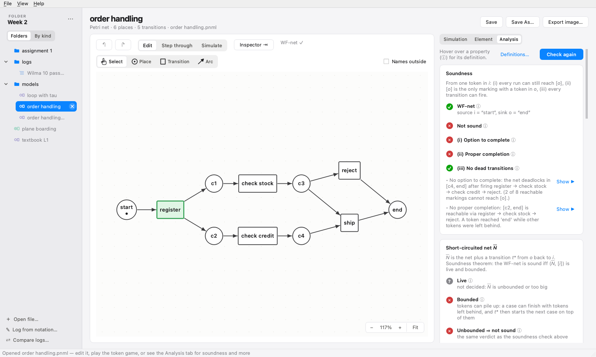

**In the sidebar**

- **Every event log and net in the folder** is listed, open or not. Files
  that are not open yet are lighter: **click one to open it**. Closing a file
  (✕ or ⌘W) puts it back in that state; it stays in the folder.
- **Folders** shows the folder as it is on disk, with collapsible subfolders
  (folders first, then files, by name). **By kind** groups the files into
  event logs, Petri nets and coloured nets instead. The choice, and which
  subfolders are open, is remembered for each folder.
- **Organise from the app**: right-click for **New Folder…**, **Rename…**,
  **Show in Finder** and **Move to Bin** (recoverable from the Bin; never a
  hard delete). **Drag files onto a subfolder** to move them on disk. An open
  file that is moved or renamed stays open, unsaved edits included. Drag a
  file out of the sidebar to Finder to copy it there.
- Subfolders are listed up to three levels deep and 500 files (a row says
  so when there are more), with hidden files and tools' folders
  (`__pycache__`, `.git`, …) skipped, as Finder does.

**From the app to the folder**

- **New nets are files from the start**: *New Petri Net* creates
  `Untitled 1.pnml` (a coloured net, `Untitled 1.cpn`) in the folder. Rename
  the net (double-click its name) and the file is renamed with it.
- **Edits are saved as you go** (autosave): a second after you stop editing,
  and when you switch to another file or quit. There is no "edited" dot, and
  undo still works. Turn it off with **File ▸ Autosave**. **File ▸ Revert to
  Saved…** goes back to the file as it was when you opened it.
  A `.cpn` model made in CPN Tools is not autosaved (OpenProcess would rewrite it
  in its own writer) until you save it once yourself with ⌘S.
- **Logs you make are files too**: a log typed in notation is saved as
  `<name>.log.txt` (still in notation), a filtered log as `<log> (filtered).xes` next to the log it
  came from, and a CPN simulation's log as `<model> simulation.xes`.
- **A discovered model** stays in the **UNSAVED** group until you press
  **Keep**, so trying algorithms does not fill the folder. Keep saves it as
  PNML next to its log.
- Saving writes a temporary file and then swaps it in, so a crash never
  leaves a half-written file.

**From the folder to the app**

- Files **added, renamed or deleted in Finder** (or by any other app, a
  `git pull`, iCloud) appear and disappear by themselves, in about half a
  second on macOS.
- **An open file changed on disk** (a `.xes` exported again from ProM, a
  `.pnml` edited in WoPeD) is **reloaded** by itself. If it also has edits in
  OpenProcess that are not saved yet, a bar above the page asks: *Reload (lose my
  edits)* or *Keep Mine*. OpenProcess's own saves are recognised and never reload.
- **An open file moved or renamed in Finder**, within the folder, stays open
  and follows the file to its new place, unsaved edits included.
- **An open file deleted, or moved out of the folder,** stays open, shown in
  italics with a *missing* bar: *Save As…* to keep it. It is not quietly
  recreated.
- If a net **cannot be saved automatically** (a read-only folder, a full
  disk), a bar says so once and the net is saved with ⌘S again, with its
  "edited" dot, until saving works.
- A file still being copied in is not read half-way.
- With iCloud Drive's *Optimise Mac Storage*, files that are only in iCloud
  are listed with a ☁: click one to download and open it.

**Files from elsewhere**

Opening a file from outside the folder (*File ▸ Open…*, *Open Recent*, or
dropping it on the window) asks whether to **copy it into the folder** (the
default: the original stays where it is), **move it in**, or **open it from
where it is**. Tick *Always do this* to stop asking for that folder, or set
the default in **Settings**. A file with the same name already in the folder
is never overwritten silently: *Keep Both* (`Wilma 50 2.xes`) or *Replace*
(the old one goes to the Bin). Dropping a file onto a subfolder in the
sidebar puts it there. Files opened where they are appear under **OTHER
FILES**.

**Coming back**

- **What you had open comes back** the next time you open the folder, and
  the app reopens the last folder at launch. This is kept in a small hidden
  file, `.openprocess`, in the folder, with paths relative to the folder, so it
  keeps working if you move or sync the folder. Delete it to start fresh.
- Switch with **File ▸ Open Recent Folder**, the buttons on the welcome
  page, or the **⋯** menu next to the folder's name, which also has *Show in
  Finder*, *New Folder…* and *Close Folder*.

Opening a folder closes the files that are not in it (it asks first about
unsaved changes). Without a folder, the app works with loose files as
before: nothing is autosaved or created on disk until you save it, and the
files you had open come back at launch (*File ▸ Reopen Files at Launch*
turns that off).

A tip for the course: one folder per week inside your course folder, e.g.
`Process Mining/Week 2`, with the week's logs and the nets you make.

---

## Petri nets and WF-nets

Nets drawn as in the lectures and the book:

- **Places** are circles with black tokens inside, drawn as dots up to 5 and
  as a number above that.
- **Transitions** are boxes with their name inside. A **silent (τ)**
  transition is a black bar.
- **Arc weights** above 1 are written on the arc.
- **Names** go inside the places and transitions, which grow to fit them.
  Tick **Names outside** in the toolbar to put them underneath instead; you
  can then drag each name where you want it. Both are saved in the PNML file.

Select anything to edit it in the **Element** tab: a place's name and
tokens, whether a transition is silent, an arc's weight and direction.

**Analysis tab**

Every property is defined mathematically in
[**docs/definitions.md**](docs/definitions.md). In the app, **hover over a
property** (the ones marked ⓘ) to see its definition *filled in for your
net* — with your place names, and when it fails, the marking and firing
sequence that break it. **Click** it to keep the definition open and follow
links to the definitions it builds on; **Help ▸ Definitions** lists them all.

<p align="center">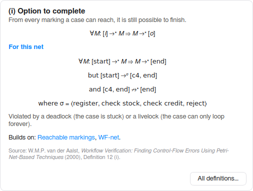</p>

- **WF-net:** exactly one source place *i*, one sink place *o*, and every
  node on a path between them.
- **Soundness:**
  - (i) option to complete;
  - (ii) proper completion;
  - (iii) no dead transitions.

  Every violation comes with a firing sequence as its counterexample, and
  **Show ▶** plays it on the net.
- **Short-circuited net N̄:** the net plus a transition *t\** from *o* back
  to *i*. By the soundness theorem, the net is sound iff (N̄, [i]) is **live
  and bounded**; both are shown, with the transition that can't fire again
  and the marking where that happens. Safe and deadlock-free are shown too.
  **Open the short-circuited net** draws it.
- **Structure:** **free-choice**, **well-structured** (no PT- or TP-handles
  in N̄, with the two paths of a handle spelled out) and **S-coverable**,
  plus the start and end rule: a quick check for transitions that need *i*
  or *o* together with another place.
- **Invariants:** the **P-invariants** (weighted token counts that never
  change, e.g. `start + c1 + c3 + end = 1`) and the **T-invariants** (of N̄
  for a WF-net), and whether they cover the net. Covered by P-invariants
  means bounded from any marking; a transition in no T-invariant of N̄ proves
  the WF-net unsound. **Incidence matrix…** shows the matrix they come from.
- **Behavioural properties** of the net as drawn: bounded, safe,
  deadlock-free, dead transitions, live, reversible. A WF-net always stops
  in [o], so that dead marking is marked as expected.
- **Footprint:** the → ← ‖ # matrix of the net's behaviour, to compare with
  a log's footprint (α-algorithm, footprint conformance).
- **Reachability graph…**, or a coverability graph with ω when the net is
  unbounded.
- **Conformance with a log…** opens the net as a model next to your logs,
  for token replay and alignments.

| The counterexample, replayed | The footprint of the net |
|---|---|
| 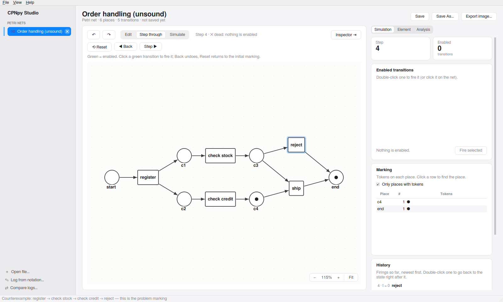 | 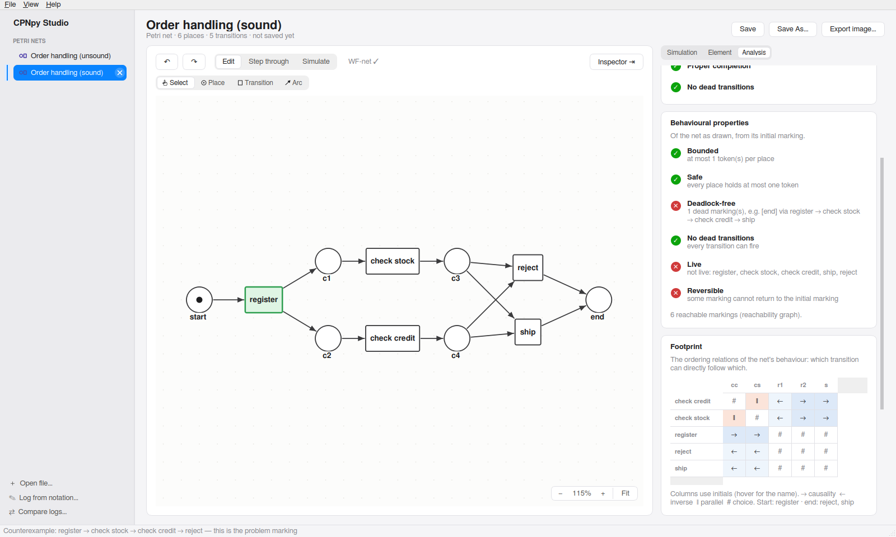 |

**Also on the Petri net page**

- **Step through / Simulate:** the token game, fired by hand or at random.
  With **Trace** ticked, every fired transition shows its step numbers and
  the arcs the tokens used light up, the latest step strongest.
- **Generate event log…:** plays the net out many times and opens the
  traces as a log.
- **Saving:** nets are saved as **PNML** (ProM, WoPeD and PM4Py read it), or
  as `.cpn`. *Save As* names the net after its file. With a folder open, a
  new net is `Untitled 1.pnml` in the folder from the start and is saved as
  you edit ([Folders](#folders-one-per-week)); without one, it is called
  *Untitled 1* until you save it.
- **Renaming:** double-click the net's name in the sidebar, or its title
  above the canvas. The file is renamed with it, in the same folder (an
  existing file is never overwritten).
- **Opening:** a `.pnml` file opens in this editor. A model you discovered
  has **✎ Edit a copy** to bring it here.

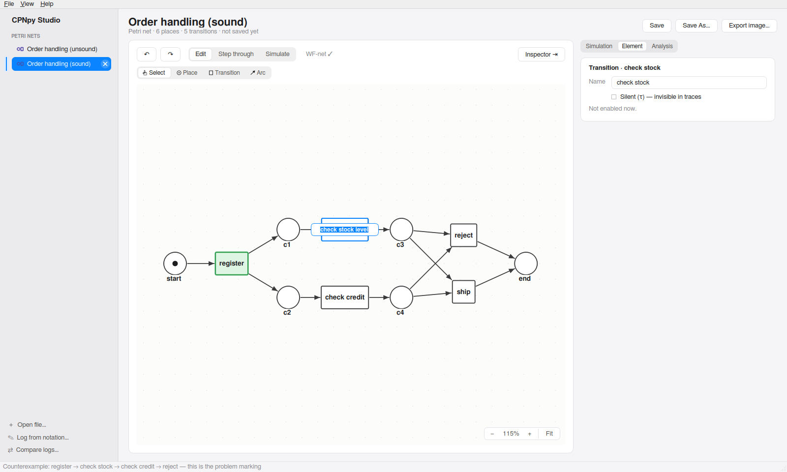

---

## Process mining

| Log overview | Dotted chart |
|---|---|
| 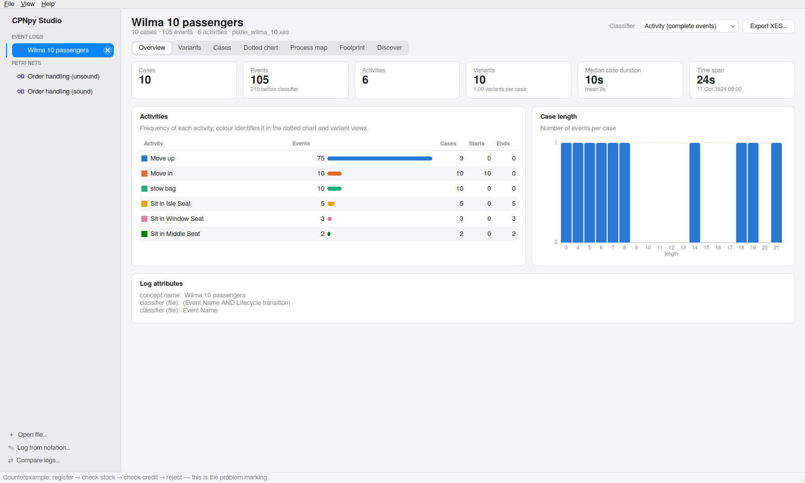 | 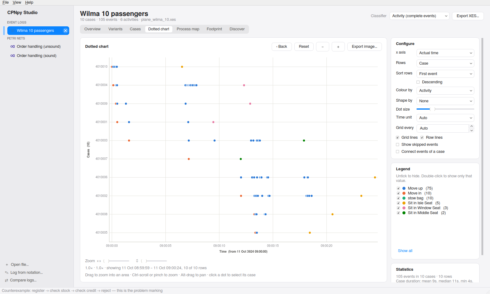 |

- **Logs:**
  - XES, XES.GZ and CSV (you map the columns);
  - the course's notation, e.g. `[<a,b,c,d>^3, <a,e,d>]` (or `⟨a,b⟩³` as
    in the book);
  - XES, CSV and notation export.
- **Edit…** a log after opening it: as notation (a log you typed comes back
  exactly as you typed it, so you can change it), or case by case — add,
  delete, duplicate and reorder events and cases, edit activities,
  timestamps and resources, rename or remove an activity everywhere. The
  edit is saved to the log's file; XES and CSV logs keep their other
  attributes.
- **Filter** (as in ProM and Disco): keep cases in a time frame, cases that
  start or end with chosen activities, only the events of chosen activities
  (or the cases that do or do not contain them), cases of a certain length,
  and the most frequent variants. A preview shows what is left; the result
  opens as a new log.
- **Explore:** overview figures, variants, cases, a ProM-style **dotted
  chart**, a **process map** (directly-follows graph with frequency or
  performance), and the **footprint** matrix.
  - Dotted chart axes: actual time, time since case start, % of case
    duration, or logical order (in the log, or within the case).
  - Time unit (Auto, or seconds up to years) and a grid step you can type in.
  - Colour and shape by any attribute. The default palette can be changed
    per value: right-click a value in the legend and pick its colour.
- **Discover:**
  - α-algorithm, which shows its eight steps;
  - Inductive Miner and IMf;
  - Heuristics Miner, as a dependency graph or as a Petri net: which forks
    are AND and which XOR is learned from the log (a causal net, whose
    bindings are listed). Like in ProM, such a net fits its log but is not
    always sound;
  - **state-based regions**, two-phase: the log becomes a transition system
    through a state function you choose (the prefix, postfix or both of each
    event; as a set, multiset or sequence; over the last *k* events or all
    of them), and its minimal regions become the places. The derivation
    shows the transition system (pick a trace to light up the states it
    passes through), the regions, GER and minimal pre- and post-regions of
    every event, state separation and forward closure, and whether the
    net's reachability graph is isomorphic to the transition system.
- **Transition systems** (File ▸ New Transition System…, or a `ts.txt` file):
  type one as `s0 -a-> s1, s0 -b-> s2` and get the same region analysis and
  synthesis. *Is this a region?* answers yes or no for any set of states
  (type it or click the states), and for no names the event and the two
  transitions that cross it differently.
- **Models:**
  - token game;
  - soundness and properties;
  - reachability graph;
  - PNML / PNG / SVG export.
- **Conformance:**
  - token-based replay and optimal alignments, both drawn on the model;
  - fitness, precision, generalisation and simplicity;
  - alignments per variant.
- **Compare logs:** key figures, activity and variant shares, and linked
  dotted charts, side by side.
- **Compare nets** (File ▸ Compare Nets…): do two nets allow the same
  complete traces? Silent steps are ignored and transitions matched by
  label, so layout and place names do not matter. You get the shortest
  traces that differ, both ways, each replayable in the token game. Exact
  for bounded nets; for unbounded ones, up to a trace length (and it says
  so).

| Process map | Discovering a model |
|---|---|
| 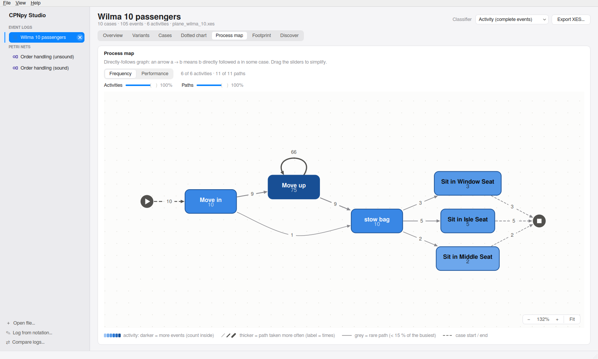 | 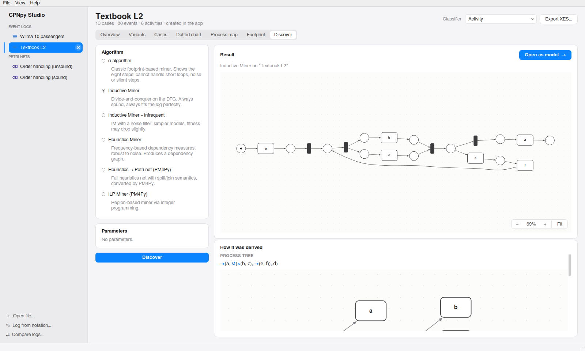 |

| α-algorithm result | Conformance (alignments on the model) |
|---|---|
| 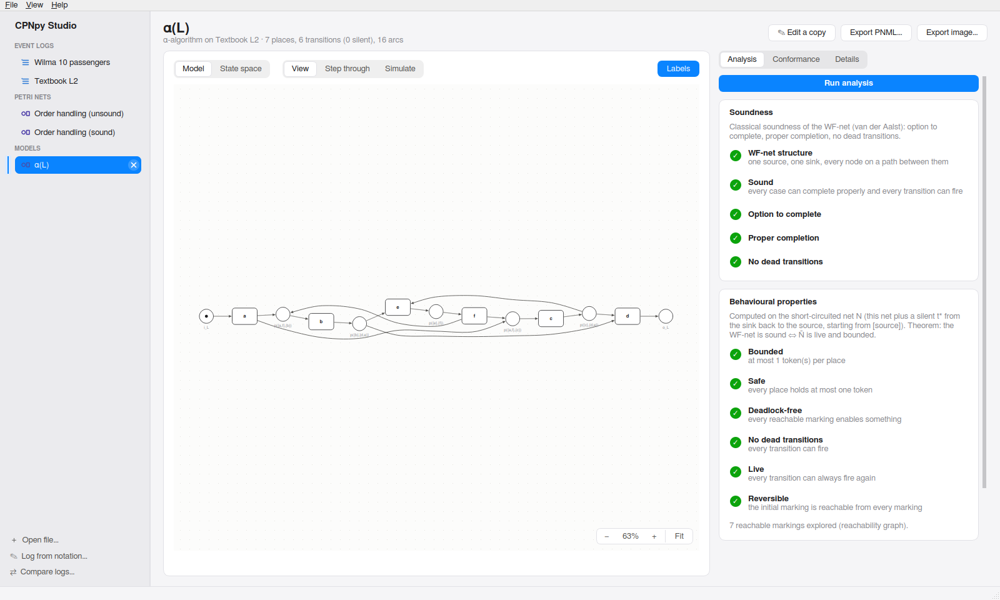 | 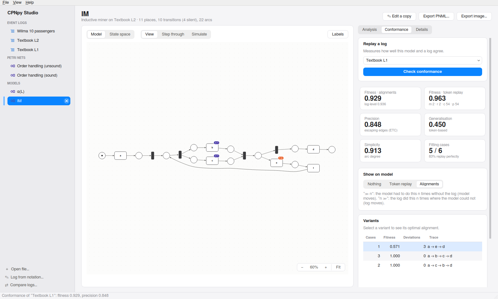 |

| Comparing two logs | Linked dotted charts of three boarding strategies |
|---|---|
| 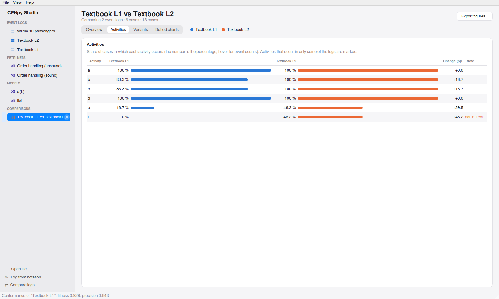 | 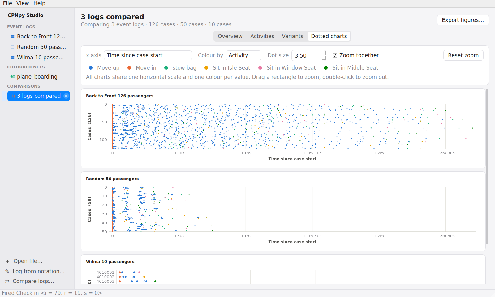 |

The app follows the system's light or dark appearance:

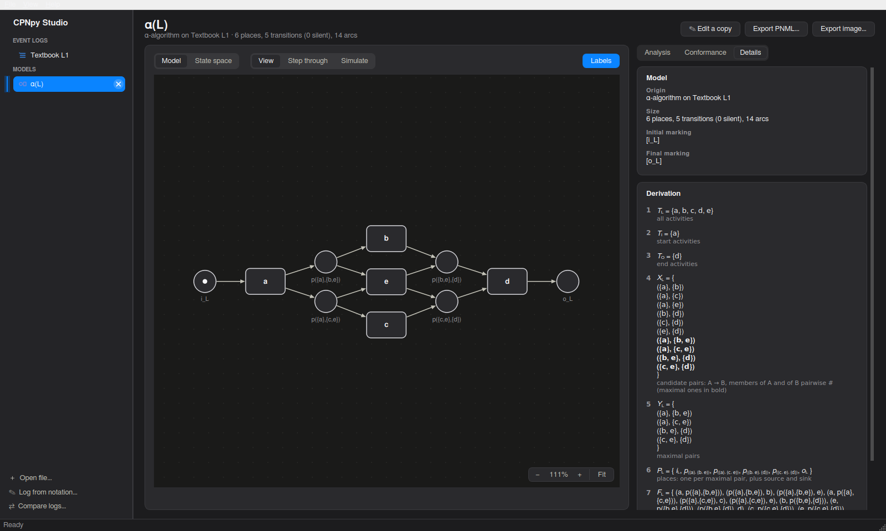

---

## Learn

OpenProcess Learn is the teaching side of the app, built on top of it: exercise
packs with answer boxes that the app checks. Click an exercise folder in the
sidebar, **Learn ▸ Open Exercise Pack…**, or **Learn ▸ Open Demo Exercises**
(it asks where to put a copy, since your answers are saved next to the
exercises): the window switches to a view made for working through a pack
without distractions, and *Exit* brings your folder back exactly as it was.

- **The worksheet** on the left is the question top to bottom, with an
  answer box wherever one is needed: yes/no, multiple choice, a set
  (`{a, b}`, sets of sets, or pairs like `({a}, {b,d})`), a number, a short
  text, a **footprint matrix**, a **firing sequence** (which you can play in
  the net), a **marking** or a set of markings, the net as **(P, T, F, m₀)**,
  an **incidence matrix** or a **reachability graph**, the Inductive Miner's
  **cuts, sublogs and process tree**, a **replay table** (p, c, m, r), an
  **alignment**, a **ranking** of models, a **prediction** of what an
  algorithm will give, free text, a **net to draw** in the editor beside it,
  or a **workflow to build** on the canvas beside it.
- **Check** says whether each answer is right — and when it is not, how far
  off it is (“2 of your items are right, 1 is missing”, the wrong cells of a
  matrix, which part of the tuple is off, the shortest traces where your net
  differs, which you can replay) without giving the answer away. Typed
  notations show how they are read as you type. *Hint* and *Show answer* are
  there when you want them.
- **The materials** on the right are what the exercise gives: the log, the
  transition system, the given net (to play, not change), your own net, and
  the Workflow tab. Results that would give answers away — soundness, the
  footprint, discovered models, regions… — stay hidden until you reveal them.
- **Notes** (✎ in the top bar) opens scratch paper under the worksheet for
  working things out, kept with the exercise.
- **Points and exams.** Every answer box is worth points (a partly right
  answer earns a part), and the overview shows the score so far. A pack can
  be an **exam**: a clock in the top bar, no hints or answers, nothing
  revealed, and the answers locked when the time is up. *⋯ ▸ Export Marks…*
  writes the marks as CSV. A pack can also give every student a **variant**
  of its own (a log played out from a net with a seed made from their name).
- **Your work is saved as you go**, in the exercise's folder:
  `my answers.json`, `my answer.pnml` for a net, `my workflow.cpnflow` for a
  workflow and `my notes.md`.

**Writing a pack** (for a course or an exam) is plain Markdown: put an
`answer` block wherever students should answer.

````
**b.** Give the start activities $T_I$.

```answer
type: set
compute: alpha.T_I
points: 2
hint: Which activities does a trace begin with?
```
````

`compute:` works the right answer out from the exercise's own log, net or
transition system (α-algorithm steps, the Inductive Miner's cuts, soundness
and its conditions, markings and matrices, replay, regions, fitness… and any
box of the workflow library: `box(alpha_miner).net.transitions`), so most
answers need not be written by hand. **Learn ▸ Writing Exercise Packs**
([openprocess/learn/exercise-packs.md](openprocess/learn/exercise-packs.md)) lists every
box type and computed answer. From a terminal, `openprocess exercises check <pack>`
reports mistakes in a pack before you share it, `openprocess exercises marks <pack>`
prints the marks, `openprocess exercises computes` lists every compute, and
`openprocess exercises import exam.txt <pack>` (or **Learn ▸ Make a Pack from an
Exam…**) turns a past exam's text into a skeleton pack, one exercise per
question with an answer block per part, for you to finish. Exercises written
for earlier versions still work: a sheet written in lettered parts (a., b., …)
gets a box under each part, with that part of `answer.md` as its model answer.

The code is `openprocess.learn` (no Qt: the worksheet format, the notations, the
computed answers and the checks) and `openprocess.gui.learn` (the window).

## Coloured Petri nets

A reimplementation of the modelling, simulation and analysis parts of CPN
Tools / CPN IDE, including their **CPN ML** inscription language: colour
sets, variables, functions, guards and timed tokens.

- **Edit:** places, transitions and arcs, with their inscriptions, guards,
  time delays and declarations (syntax-highlighted). Undo and redo cover
  everything.
- **Hierarchy:** substitution transitions run their subpages (a port place
  is the socket place it is assigned to), also several levels deep. Select
  a substitution transition and press **Open subpage** to go there.
- **Step through:** green transitions are enabled. Click one to fire it, or
  pick an exact binding in the inspector. **Back** undoes a step, and
  **Trace** highlights the path so far.
- **Simulate:** Play (1–60 firings per second) or Fast-forward. The firing
  history can be exported **as an event log** and mined straight away.
- **State space:** runs in a separate process, so it can be stopped at any
  moment. It reports dead markings, home markings, liveness and bounds.
- **Rendering:** models look the way CPN Tools and CPN IDE draw them
  (bendpoints, label positions, token bubbles), and they save back to
  `.cpn`.

| Stepping through a model | Editing an arc (handles on every bend) |
|---|---|
| 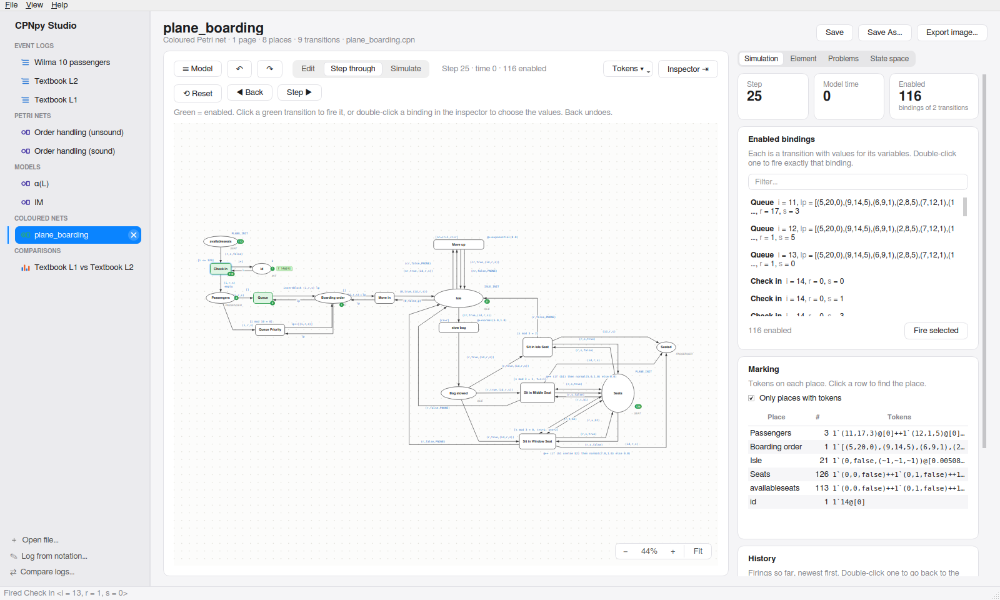 | 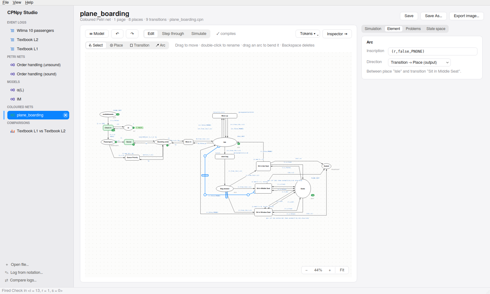 |

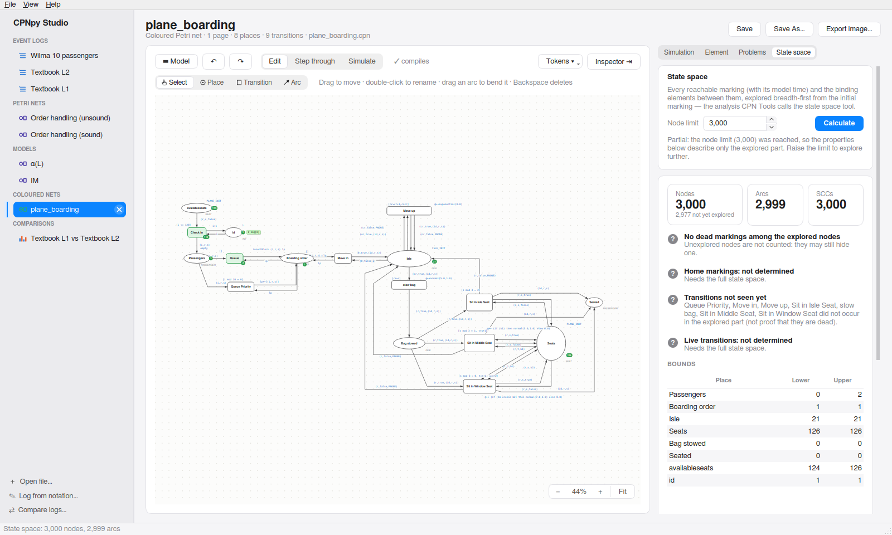

---

## Working on the canvas

Both editors work the same way. Arcs follow the rules of CPN IDE.

| To… | Do this |
|---|---|
| Add a place / transition | Pick **Place** / **Transition**, click the canvas, type the name, press Return (or just click elsewhere: the name box closes and keeps the name) |
| Rename | Double-click the place or transition, or use the Element tab |
| Rename a net or log | Double-click its name in the sidebar or the title above the canvas. A net named after its file (as every opened or saved net is) renames the file too, in the same folder. |
| Connect | Move the mouse just outside a place or transition and drag the faint arrow that appears onto another node. Or pick **Arc** and drag from one node to another, or click one node, then the other. Joining two places (or two transitions) is refused, with an explanation. Esc cancels. |
| Grow a net quickly | Drag a node's arrow (or, with **Arc**, drag from a node) out onto empty canvas: a see-through preview shows what letting go will add — a transition after a place, a place after a transition — joined by an arc. It lines up with nodes it is nearly level with (or lands on the grid). Type its name, or click its arrow and keep going. One undo takes the node and its arc away. |
| Pan | Scroll (two fingers on a trackpad; Shift + wheel goes sideways), drag with the middle mouse button, or hold Space and drag. The canvas goes on in every direction, so there is always room to start a new part beside the net; *Fit* frames the whole net again. If the net is panned right out of view, a button at the top of the canvas points to it and brings it back. |
| Zoom | ⌘-scroll / Ctrl+scroll or pinch zooms about the pointer; or − % + in the corner |
| Keep things neat | Tick **Snap to grid** (next to *Names outside*): new and moved places, transitions and arc bends land on the canvas's dots. **Snap All to Grid** neatens a net drawn freely: every place, transition and arc bend moves to the nearest dot, and the layout stays yours. Undo puts it back. |
| Move things | Drag them. Nodes snap into line with other nodes (dashed guides show it). Drag on empty canvas to select several. |
| Bend an arc | Press anywhere on the arc and drag: that adds a bend. Drag an existing bend (a small circle) to move it. |
| Remove a bend | Drag it back into line with its neighbours |
| Slide a straight segment | Drag the bar in the middle of a horizontal or vertical segment |
| Reconnect an arc | Drag one of its ends onto another node |
| Move a label | Drag it (names can be dragged once **Names outside** is ticked) |
| Delete | Select, then Delete or Backspace (⌫) |
| Undo / redo | ⌘Z / ⇧⌘Z (Ctrl+Z / Ctrl+Shift+Z), or ↶ ↷ |

The tool buttons have icons, and the mouse cursor over the canvas shows the
active tool: a plain pointer for Select, a crosshair with a circle, square
or arrow for the others.

---

## Keyboard shortcuts

The app shows each shortcut the way your system writes it.

| Action | macOS | Windows / Linux |
|---|---|---|
| New Petri net | ⌘N | Ctrl+N |
| New coloured Petri net | ⇧⌘N | Ctrl+Shift+N |
| Open… | ⌘O | Ctrl+O |
| Open folder… | ⌥⌘O | Ctrl+Alt+O |
| Open coloured Petri net… | ⇧⌘O | Ctrl+Shift+O |
| Log from notation… | ⌘L | Ctrl+L |
| Compare logs… | ⇧⌘C | Ctrl+Shift+C |
| Save / Save As | ⌘S / ⇧⌘S | Ctrl+S / Ctrl+Shift+S |
| Undo / Redo | ⌘Z / ⇧⌘Z | Ctrl+Z / Ctrl+Shift+Z (or Ctrl+Y) |
| Delete selection | ⌫ | Delete or Backspace |
| Step (fire one random enabled transition) | ⌘. | Ctrl+. |
| Zoom in / out / fit / 100 % | ⌘+ / ⌘− / ⌘0 / ⌥⌘0 | Ctrl++ / Ctrl+− / Ctrl+0 / Ctrl+Alt+0 |
| Zoom with the mouse | ⌘-scroll or pinch | Ctrl+scroll or pinch |
| Pan | scroll, middle-drag, or Space + drag | scroll, middle-drag, or Space + drag |
| Toggle sidebar | ⌥⌘S | Ctrl+Alt+S |
| Settings… | ⌘, | Ctrl+, |
| Welcome page | ⌘1 | Ctrl+1 |
| Export selected… | ⌘E | Ctrl+E |
| Close / close all | ⌘W / ⇧⌘W | Ctrl+W / Ctrl+Shift+W |
| Cancel drawing an arc | Esc | Esc |

---

## Files

| Format | Read | Write |
|---|---|---|
| Event logs: `.xes`, `.xes.gz`, `.csv` | ✓ | `.xes`, `.xes.gz`, `.csv` |
| Logs in textbook notation: `log.txt`, `*.log.txt` | ✓ | |
| Transition systems: `ts.txt`, `*.ts.txt` (`s0 -a-> s1`) | ✓ | ✓ |
| Petri nets: `.pnml` (with positions, weights, τ, arc bends) | ✓ | ✓ |
| CPN Tools models: `.cpn` | ✓ | ✓ |
| Pictures of nets and charts | | `.png`, `.svg` |
| Folder state: `.openprocess` (hidden, in the folder) | ✓ | ✓ |

Example files: `examples/petri/*.pnml` (Petri nets), `examples/*.cpn`
(coloured nets) and `tests/data/` (a plane-boarding model and log from the
course).

---

## For developers

```bash
pytest -q                 # the whole suite, including GUI tests that run offscreen
openprocess --help              # command line: check, simulate, state space, mining
```

The same commands work on macOS, Windows and Linux. `openprocess mine` covers the
process mining side: `stats`, `filter`, `discover` (α, IM, IMf, heuristics),
`conform`, `soundness` and `invariants`; `openprocess exercises check`, `marks`,
`import` and `computes` serve exercise packs. `docs/definitions.md` is
generated from `openprocess/mining/definitions.py`; after editing a definition, run
`python -m openprocess.mining.definitions > docs/definitions.md` (a test checks it).
Likewise [`docs/references.md`](docs/references.md) — every source OpenProcess's
notation and algorithms follow, also in the app under **Help ▸ References** —
is generated from `openprocess/references.py` with
`python -m openprocess.references > docs/references.md`.

The engines (`openprocess.mining`, `openprocess.ml`, `openprocess.sim`, `openprocess.analysis`)
have **no dependencies**, so they work in a notebook or a script:

```python
from openprocess.mining import read_xes, inductive_miner
from openprocess.mining.analysis import check_soundness

net = inductive_miner(read_xes("log.xes").simple_log()).net
report = check_soundness(net)
print(report.sound, report.findings)
```

[**docs/how-it-works.md**](docs/how-it-works.md) covers the architecture, the
CPN ML subset, binding search, timed nets, the state space, the file format
and the project layout.

## Workflows

**File ▸ New Workflow** opens a workflow that already runs on the first log of
your folder (or a typed log): *Discover and check* (a log, the Inductive
Miner, a fitness check), *Compare discovery* (three miners side by side),
*Noise sweep* (one setting over a range, the scores stacked), *Fitness with
confidence* (bootstrap intervals, a test and a plot; needs the `science`
extra) and *Predict the next activity*. Or start empty.

- **The page is the canvas.** Three buttons in its header: **+ Add box**,
  **Run ▶**, and **⋯** for Re-run, Record, Export experiment and Save.
- **+ Add box** (or a double-click on the canvas) opens every box, by group:
  the six core groups side by side (Input, Filter, Discover, Check, Compare,
  Output) and one line for the rest (Science, Predict, Coloured nets, Sweep,
  your own boxes) with *Show all*. Type to search them all: "alpha" finds the
  α-algorithm; Enter adds the first match.
- **Connect** by dragging from the dot on the right of a box: while you drag,
  only the inputs that take that kind of result light up, so a wrong
  connection cannot be made. Click a wire and press Delete to remove it.
- **Click a box** and the side panel appears beside the canvas, on
  **Result** (the net, the log's figures, the table, the figure; a log's
  Result has *Open as log ›* for the dotted chart, process map, footprint,
  variants and cases). Its other tabs: **How** (what the box reported: notes,
  intermediate values, the derivation), **Code** (the box's few lines and,
  under them, the actual algorithm it calls: the α-algorithm's eight steps,
  the Inductive Miner's cuts, with the work each follows and *Whole file* for
  the module) and **Settings** (a control per setting; *Sweep* a number over
  a range). **⤢** opens the tab in a window of its own; **✕**, or a click
  on the canvas, puts the panel away.
- **Only what changed runs again.** Every box shows a status dot: waiting,
  running, done, failed (the error is on the Result tab; the rest keeps
  working), or waiting for your OK.
- **Record** shows the workflow as Python and the file with its record;
  **Re-run** says what changed since it was saved (an input file, a box file,
  a seed) before running everything again.
- **Your own boxes**: a `.py` file in the folder's `boxes/` subfolder (see
  below). The app asks once per folder before running them, and reloads a
  box when its file is saved.
- **Groups**: select boxes and press ⌘G to make one box of them, with the
  connections that reach outside; double-click it to open its own canvas,
  ⇧⌘G to ungroup. *Save as a box* in the side panel writes the group to
  `boxes/`, so it is listed under *Yours* and can be used in any workflow.
- **Export experiment** (under ⋯) writes a zip with the workflow file and its record,
  the inputs, your boxes, every result as a file (CSV, PNML, SVG, XES), a
  `requirements.lock` and a README that says what was run: supplementary
  material for a paper, which `openprocess run --check` can verify.
- **The side panel** resizes by dragging the gap beside it; double-click the
  gap, or *View ▸ Reset Workflow Layout*, for its default width.

## Workflows from Python

Every algorithm is also a **box**: a Python function with type hints that
the app (from 0.7) draws on a canvas. A workflow of boxes runs from Python
or from the command line, and its `.cpnflow` file records what is needed
to get the same numbers again: fingerprints of the input files and of the
box code, every seed, and the installed packages.

```python
from openprocess.flow import Workflow, Runner, save
from openprocess.flow.boxes.input import open_log
from openprocess.flow.boxes.discover import inductive_miner
from openprocess.flow.boxes.check import check_fit

wf = Workflow("orders")
log = wf.add(open_log, {"file": "orders.xes"})
model = wf.add(inductive_miner, {"noise": 0.2})
fit = wf.add(check_fit)
wf.connect(log, model); wf.connect(model, fit, "model"); wf.connect(log, fit, "log")
run = Runner().run(wf)
print(run.value(fit).metrics)                  # fitness, precision, generalisation, simplicity
print(run.result(model).explanation.steps)     # how the Inductive Miner got there
save(wf, "orders.cpnflow", run)
```

```bash
openprocess run orders.cpnflow --check     # re-run; fails if any result differs from the record
openprocess run orders.cpnflow --sweep noise=0..0.5 step 0.1
openprocess boxes                          # the 47 boxes, with a folder's boxes/
openprocess datasets list                  # the BPI Challenge, Sepsis, ... logs by name
```

A box of your own is one function in a `boxes/` folder:

```python
from openprocess.flow import box, EventLog, TransitionSystem

@box(group="Discover")
def last_two(log: EventLog, representation: str = "multiset") -> TransitionSystem:
    """The last two activities as the state."""
    ...
```

`pip install -e ".[science]"` adds the pandas, NumPy, SciPy and matplotlib
boxes (describe, bootstrap intervals, tests, plots). Large logs are read
into columns rather than objects, so a million events fit in memory.
[**docs/workflows.md**](docs/workflows.md) has the whole framework: writing
a box, the types, the *How* tab, sweeps, the prediction pipeline, the
record and running in CI.

**Building the apps.** `packaging/` turns OpenProcess into a standalone app with
PyInstaller. In the environment:

```bash
pip install pyinstaller
python packaging/build.py      # → dist/OpenProcess.app or dist/OpenProcess/, plus a .dmg / .zip / .tar.gz
```

The script also smoke-tests the result. Each system can only build its own
app, so the [Build apps](.github/workflows/build-apps.yml) workflow builds all
of them on GitHub: for every pull request (after the test suite passes; not
for documentation-only changes) and for every release tag. Download them from
the run's page, under *Artifacts*, or start a build by hand with *Run
workflow* on the Actions tab.

**Publishing a release:**

1. Add a section for the new version at the top of
   [CHANGELOG.md](CHANGELOG.md) (`## 0.4.0`, then a few bullet points). Write
   it for the people using the app: it becomes the text of the release on
   GitHub, and the app shows it when it offers the update.
2. Set `__version__` in `openprocess/__init__.py` to the same version and merge
   both into `main`. It is the only place the version is written:
   `pyproject.toml`, the download names and the app's update check all read
   it from there.
3. Tag that commit with the same version and push the tag:

   ```bash
   git pull
   git tag v0.4.0
   git push origin v0.4.0
   ```

About five minutes later the
[Releases page](https://github.com/s4mstruthers/openprocess/releases) has the
macOS (Apple silicon and Intel), Windows and Linux apps. The build refuses a
tag that does not match `__version__`, or a version with no section in
`CHANGELOG.md`.

**Updates.** Each time it opens, the app checks the latest release on GitHub
(*Settings* turns that off). If there is a newer version, a slim bar at the
top of the window says so, without getting in the way: **What's New** shows
the changelog of every version you don't have yet, **Install Now** installs
it, **Skip This Version** stays quiet until the next one, and **✕** closes the
bar until next time. **Help ▸ Check for Updates…** checks straight away.
Installing downloads the file for the system, checks it against the SHA-256
GitHub lists for it, unpacks it next to the app, and restarts into the new
version (the old one is kept until the new one is in place).

Run from source (a git clone), the app never changes itself: the bar's
button says **How to Update** and explains `git pull`. It only appears when
the clone is older than the latest release. See
`openprocess/gui/studio/updates.py`.

---

## Limitations and roadmap

Plainly stated:

1. **A subpage used by several substitution transitions** (one module,
   several instances) is reported as a problem rather than simulated: give
   each use its own copy of the page. Subpages used once, at any depth,
   simulate.
2. **No CPN monitors or simulation reports**, and **no fairness
   properties** in the state space report (it says so).
3. **CPN ML is a large subset, not all of Standard ML**: no `exception`
   declarations or `handle`, no `datatype` or `structure` declarations, and
   characters are one-letter strings. See
   [docs/how-it-works.md](docs/how-it-works.md#the-cpn-ml-subset).
4. **Alignments are exact but unoptimised**: they can take seconds on
   heavily concurrent models. They run in the background.
5. **Plain Petri nets live on one page.**
6. **Regions are found exhaustively**, so only for transition systems of up
   to 26 states (the result says when this limit is hit), and label
   splitting for transition systems that are not elementary is not
   suggested yet. Transition systems are typed, not drawn.

Next up: several instances of a subpage, CPN monitors, and signed apps that
open without a security prompt.

## Licence

MIT. See [LICENSE](LICENSE).
